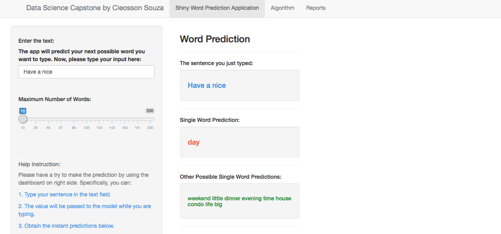

Data Science Capstone -  SwiftKey Data Product - Word Prediction
========================================================
author: Cleosson Souza
date: 24 April 2016
transition: rotate
class: illustration
rtl: false
navigation: slide
font-family: 'Risque'
css: custom.css
width: 1024
height: 768

Application Overview
========================================================

If you haven't tried out the app, go [here](https://cleosson.shinyapps.io/DataScienceCapstone/) to try it!

- Make prediction as you type
- Enter the text in the left panel and see the sentence typed and the predictions in the right panel
- Adjust the number of predicted words, default 100

Algorithm
========================================================

- N-gram model with "Stupid Backoff" ([Brants et al 2007](http://www.cs.columbia.edu/~smaskey/CS6998-0412/supportmaterial/langmodel_mapreduce.pdf))
- Creates the ngram 4, 3 and 2.
- Sums the frequency of ngrams (4,3 and 2).
- Adds the ngram into a hash table:
    - Ngram 4, the three first words are the key and the last word is the value
    - Ngram 3, the two first words are the key and the last word is the value
    - Ngram 2, the  first words are the key and the last word is the value
- The algorithm checks what is been typed using the entered text as a key in the hash table to get the next word, the value.

Algorithm
========================================================

Algorithm
========================================================

- The underlying code stores the n-gram into a hash table, where the words entered by the user are the key and the next word is the value in the hash table
- The hash table is a enclosing environment (new.env)
- "Stupid Backoff" is designed for scale. We're restricted to 100mb on ShinyApps.
